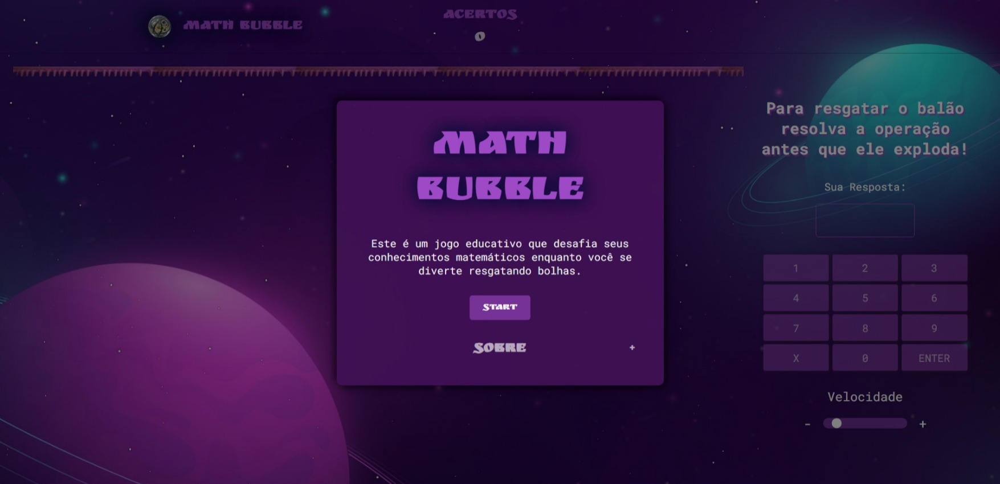

# Math Bubble

Math Bubble é um jogo educativo que desafia seus conhecimentos matemáticos enquanto você se diverte resgatando bolhas. Este projeto simples combina diversão e aprendizado, incentivando os jogadores a resolver operações matemáticas para evitar que as bolhas explodam.

## Como Jogar

1. **Início do Jogo:**

   - Ao iniciar o jogo, você será recebido com uma tela de boas-vindas. Clique no botão "Start" para iniciar o desafio.

2. **Objetivo:**

   - Uma bolha contendo uma operação matemática se moverá do fundo para o topo da tela.
   - Sua missão é resolver a operação antes que a bolha alcance o topo ou exploda devido a respostas incorretas.

3. **Resolvendo a Operação:**

   - Utilize o teclado virtual na tela para inserir sua resposta.
   - Clique nos botões numéricos para compor a resposta desejada.
   - O botão "X" permite apagar a resposta se necessário.
   - Pressionar "Enter" após inserir sua resposta verifica se está correta.

4. **Pontuação e Vidas:**

   - Cada resposta correta adiciona pontos à sua pontuação total, exibida no canto superior direito.
   - Respostas incorretas resultam na perda de uma vida. O número de vidas restantes é exibido no canto superior esquerdo.
   - Se perder todas as 5 vidas, o jogo termina.

5. **Velocidade do Jogo:**

   - Você pode ajustar a velocidade da bolha usando o controle deslizante na parte inferior da tela.

6. **Próxima Rodada:**

   - Após cada rodada, a tela será limpa, e uma nova bolha com uma operação matemática será gerada.
   - O jogo continua até que você perca todas as vidas.

7. **Fim do Jogo:**
   - Se suas vidas chegam a zero, uma modal de "GAME OVER" será exibida.
   - Você pode reiniciar o jogo clicando no botão "Jogar Novamente".
